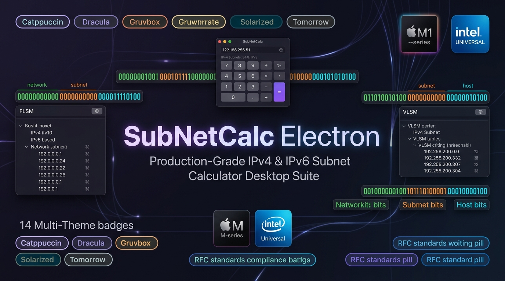
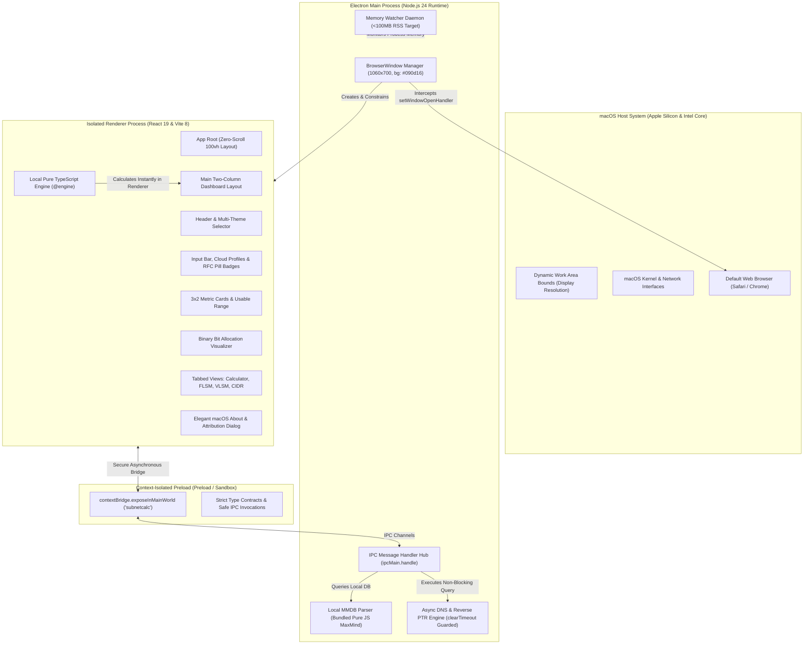

<!-- markdownlint-disable-file MD033 MD041 -->

<p align="center">
  <a href="https://github.com/alsyundawy/SubNetCalc-Electron">
    
  </a>
</p>

<p align="center">
  <a href="https://github.com/alsyundawy/SubNetCalc-Electron">
    
  </a>
</p>

<h1 align="center">SubNetCalc Electron</h1>

<h3 align="center">High-Precision, Low-Footprint IPv4 & IPv6 Subnet Calculator with 14 Multi-Themes for macOS & Cross-Platform</h3>

<p align="center">
  <a href="https://github.com/alsyundawy/SubNetCalc-Electron/releases/latest"></a>
  <a href="https://apple.com/macos"></a>
  <a href="https://www.electronjs.org/"></a>
  <a href="https://react.dev/"></a>
  <a href="https://www.typescriptlang.org/"></a>
  <a href="#downloads--artifact-catalogs"></a>
  <a href="https://github.com/alsyundawy/SubNetCalc-Electron/blob/main/LICENSE"></a>
  <a href="https://github.com/alsyundawy/SubNetCalc-Electron"></a>
</p>

<p align="center">
  A production-grade, highly optimized, and zero-vulnerability desktop application for calculating IPv4 and IPv6 subnets, network boundaries, binary bit allocations, and address classifications. Combining the mathematical rigor and RFC test oracle parity of the canonical <strong>SubNetCalc</strong> CLI tool by Dr. Thomas Dreibholz with the workflow concepts (interactive mask sync, FLSM, VLSM, CIDR summarization) of Julien Mulot's macOS SubnetCalc and the 14-palette aesthetic of Harry Dertin Sutisna Alsyundawy's SubnetCalc-MacOS, re-engineered for modern desktop environments with pure TypeScript, zero window scrolling, real-time bit visualizer, local GeoIP lookup, and native Apple Silicon acceleration.
</p>

<p align="center">
  <a href="#downloads--artifact-catalogs">
    
  </a>
  <a href="https://github.com/alsyundawy/SubNetCalc-Electron/releases/latest">
    
  </a>
  <a href="https://github.com/dreibh/subnetcalc">
    
  </a>
  <a href="https://github.com/mulot/SubnetCalc">
    
  </a>
  <a href="https://github.com/alsyundawy/SubnetCalc-MacOS">
    
  </a>
  <a href="https://github.com/alsyundawy/SubNetCalc-Electron/issues">
    
  </a>
</p>

> Maintained, engineered, and packaged by<br>
> **[`HARRY DERTIN SUTISNA ALSYUNDAWY (@alsyundawy)`](https://github.com/alsyundawy)** —<br>
> High-performance networking suite for macOS and cross-platform desktop, featuring pure TypeScript subnet engine calculation, 100% test oracle parity with upstream `dreibh/subnetcalc`, GUI ergonomics inspired by `mulot/SubnetCalc` & `alsyundawy/SubnetCalc-MacOS`, strict WCAG AAA color contrast, and zero-leak memory watcher governance.
>
> 🍏 **[`Latest Releases (v1.1.1)`](https://github.com/alsyundawy/SubNetCalc-Electron/releases/latest)** &nbsp;|&nbsp;
> 📖 **[`Release DocNotes`](DOCNOTE.md)** &nbsp;|&nbsp;
> 📜 **[`Changelog`](CHANGELOG.md)** &nbsp;|&nbsp;
> 📋 **[`Implementation Plan`](docs/superpowers/plans/2026-10-05-mulot-subnetcalc-feature-integration.md)** &nbsp;|&nbsp;
> 🐛 **[`Issue Tracker`](https://github.com/alsyundawy/SubNetCalc-Electron/issues)** &nbsp;|&nbsp;
> 💖 **[`Support via PayPal`](https://www.paypal.me/alsyundawy)**

---

> [!IMPORTANT]
>
> ### ⚠️ Technical Notice & Upstream Attribution
>
> **Algorithmic Heritage & Attribution**<br>
> This software draws inspiration from landmark open-source projects in the networking community:
>
> 1. **Dr. Thomas Dreibholz** ([`dreibh/subnetcalc`](https://github.com/dreibh/subnetcalc)): Canonical IPv4/IPv6 CLI subnet calculation engine, exact RFC property definitions, and test fixtures maintaining 100% test parity with upstream oracle outputs.
> 2. **Julien Mulot** ([`mulot/SubnetCalc`](https://github.com/mulot/SubnetCalc) / [`subnetcalc.mulot.org`](https://subnetcalc.mulot.org)): The classic macOS Subnet Calculator GUI, pioneering interactive mask synchronization, FLSM, VLSM, CIDR summarization, and data portability.
> 3. **Harry Dertin Sutisna Alsyundawy** ([`alsyundawy/SubnetCalc-MacOS`](https://github.com/alsyundawy/SubnetCalc-MacOS)): Modernized Swift 6 Universal 2 macOS edition with 14 multi-themes, cloud architecture profiles, and automated CI/CD.
>
> **License & Warranty**<br>
> Distributed under the terms of the permissive **MIT License**. This software is an independent clean-room implementation written in pure TypeScript and is provided on an "AS IS" basis without warranties of any kind.

---

## 🧭 Navigation

- [Overview & Value Proposition](#overview--value-proposition)
- [Key Features & Capabilities Matrix](#key-features--capabilities-matrix)
- [14-Palette Multi-Theme Engine](#14-palette-multi-theme-engine)
- [System Architecture & Component Topology](#system-architecture--component-topology)
- [macOS Hardware Acceleration & Memory Governance](#macos-hardware-acceleration--memory-governance)
- [Downloads & Artifact Catalogs](#downloads--artifact-catalogs)
- [macOS Gatekeeper & Quarantine Removal](#macos-gatekeeper--quarantine-removal)
- [Developer Setup & Quality Verification](#developer-setup--quality-verification)
- [Release DocNotes (DOCNOTE.md)](DOCNOTE.md)
- [Changelog](#changelog)
- [Upstream Credits & Attribution](#upstream-credits--attribution)
- [FAQ & Troubleshooting](#faq--troubleshooting)
- [📬 Maintainer & Contact](#-maintainer--contact)
- [💖 Support & Donation](#-support--donation)
- [License](#license)

---

## Overview & Value Proposition

Traditional subnet calculators often suffer from major limitations: they are either web-based utilities that require external internet connections, outdated utilities lacking IPv6 support, or heavy web apps that consume hundreds of megabytes of RAM while scrolling haphazardly across the screen.

**SubNetCalc Electron** addresses these issues with an uncompromising desktop architecture:

1. **Deterministic Offline Engine**: Calculations execute synchronously in pure TypeScript using 128-bit `BigInt` operations without invoking external web services, ensuring sub-millisecond calculation times and complete privacy.
2. **Fixed Zero-Scroll Viewport**: Re-architected two-column dashboard grid fitting metric cards, live binary bit cells, and tabbed attributes completely inside the native window (1060×700), eliminating window-level scrollbars.
3. **14-Palette Multi-Theme Engine**: Replaces binary light/dark switching with 14 authentic developer themes from `SubnetCalc-MacOS` (Catppuccin Mocha/Macchiato/Frappé/Latte, Dracula, Gruvbox Dark/Light, Solarized Dark/Light, Tomorrow Night Blue/Night/Eighties/Bright/Day) persisted in `localStorage`.
4. **Live RFC IP Classification Badges**: Real-time badge tagging for RFC 1918 Private, Public Internet, CGNAT RFC 6598, Loopback, Link-Local, Documentation, Multicast, Reserved, ULA RFC 4193, and GUA RFC 4291.
5. **Cloud Architecture Profiles**: Quick presets for AWS VPC, GCP Subnets, Azure VNets, Docker Bridge, Kubernetes Pod Networks, Tailscale CGNAT, and RFC 3021 Point-to-Point links.
6. **Comprehensive Protocol Support**: Full compliance with RFC 791 (IPv4), RFC 4291 (IPv6 Architecture), RFC 4193 (Unique Local IPv6), RFC 5952 (Canonical IPv6 Formatting), and RFC 3021 (31-bit Point-to-Point Links).
7. **Low-Footprint Governance**: Active memory supervisor monitoring RAM utilization (<100 MB RSS target), self-contained bundling eliminating `node_modules` inside production ASAR archives, and background process throttling.
8. **Zero Vulnerability Guarantee**: Zero CVEs reported across all dependencies on `npm audit`, hardened Content Security Policy (CSP), context-isolated preload bridges, and sandbox enforcement.

---

## Key Features & Capabilities Matrix

| Capability                           | Technical Implementation                                                                                              | Benefit                                                                                                 |
| :----------------------------------- | :-------------------------------------------------------------------------------------------------------------------- | :------------------------------------------------------------------------------------------------------ |
| **Pure TypeScript Subnet Engine**    | Synchronous bitwise arithmetic with 128-bit `BigInt` precision and zero external calculation libraries.               | 100% offline functionality, immediate keystroke recalculation, and identical outputs to upstream CLI.   |
| **14 Multi-Theme Engine**            | Decoupled palette definitions injected via dynamic CSS variables with zero DOM reflow and `localStorage` persistence. | Authentic Catppuccin, Dracula, Gruvbox, Solarized, and Tomorrow palettes for optimal code readability.  |
| **Live RFC Classification Badges**   | Real-time IP address scope analyzer mapping address space to RFC 1918, 6598, 4193, 4291, 5737, and 1112.              | Instant visual identification of private, CGNAT, documentation, loopback, or public internet addresses. |
| **Cloud Architecture Profiles**      | One-click presets for AWS, GCP, Azure, Docker, Kubernetes, and Tailscale CIDR allocations.                            | Rapid prototyping and inspection of common cloud infrastructure network topologies.                     |
| **Binary Bit Visualizer**            | Interactive rendered grid mapping network prefix bits, borrowed subnet bits, and host interface bits.                 | Instant visual clarity on bit boundary divisions and subnet sizing without manual calculation.          |
| **FLSM & VLSM Allocation Suite**     | Fixed & Variable Length Subnet Mask deconstruction engines with live capacity bars and RFC 4180 CSV export.           | Professional network design with waste optimization and spreadsheet-safe data export.                   |
| **RFC 3021 /31 PtP Support**         | Automatic recognition of 31-bit IPv4 subnets without broadcast address allocation.                                    | Accurate host provisioning for modern point-to-point router links.                                      |
| **RFC 4193 Unique Local IPv6 (ULA)** | Cryptographically secure pseudo-random Global ID generation using OS random bytes.                                    | Generates standards-compliant `fd00::/8` non-routable private subnets on demand.                        |
| **Asynchronous Reverse DNS**         | Non-blocking PTR lookup through Node.js asynchronous DNS resolver with timeout clearance.                             | Displays canonical hostnames without freezing calculation rendering or leaking timer handles.           |
| **Local Offline GeoIP Lookup**       | MaxMind MMDB binary parser bundled self-contained into the main bundle with zero native C/C++ addons.                 | Pinpoints country code and location from local databases without telemetry or external tracking.        |
| **Two-Column Compact Dashboard**     | CSS Grid dashboard with metric cards on the left and tabbed attributes & calculation history on the right.            | Perfectly fixed viewport with zero outer window scrolling on any desktop display.                       |

---

## 14-Palette Multi-Theme Engine

SubNetCalc Electron supports 14 curated developer palettes mirrored directly from `SubnetCalc-MacOS` (`ThemeManager.swift`):

| Palette Name              | Family     | Appearance | Base Background | Accent Color             |
| :------------------------ | :--------- | :--------- | :-------------- | :----------------------- |
| **Catppuccin Mocha**      | Catppuccin | Dark       | `#1e1e2e`       | `#89b4fa` (Blue)         |
| **Catppuccin Macchiato**  | Catppuccin | Dark       | `#24273a`       | `#8aadf4` (Blue)         |
| **Catppuccin Frappé**     | Catppuccin | Dark       | `#303446`       | `#85c1dc` (Sapphire)     |
| **Catppuccin Latte**      | Catppuccin | Light      | `#eff1f5`       | `#1e66f5` (Blue)         |
| **Dracula**               | Dracula    | Dark       | `#282a36`       | `#bd93f9` (Purple)       |
| **Gruvbox Dark**          | Gruvbox    | Dark       | `#282828`       | `#fe8019` (Orange)       |
| **Gruvbox Light**         | Gruvbox    | Light      | `#fbf1c7`       | `#af3a03` (Rust)         |
| **Solarized Dark**        | Solarized  | Dark       | `#002b36`       | `#268bd2` (Blue)         |
| **Solarized Light**       | Solarized  | Light      | `#fdf6e3`       | `#268bd2` (Blue)         |
| **Tomorrow Night Blue**   | Tomorrow   | Dark       | `#002451`       | `#81a2be` (Aqua)         |
| **Tomorrow Night**        | Tomorrow   | Dark       | `#1d1f21`       | `#81a2be` (Aqua)         |
| **Tomorrow Eighties**     | Tomorrow   | Dark       | `#2d2d2d`       | `#66cccc` (Cyan)         |
| **Tomorrow Night Bright** | Tomorrow   | Dark       | `#000000`       | `#7aa6da` (Light Blue)   |
| **Tomorrow Day**          | Tomorrow   | Light      | `#ffffff`       | `#4271ae` (Classic Blue) |

---

## System Architecture & Component Topology

SubNetCalc Electron enforces a strict separation of concerns between Electron's sandboxed main process, secure preload bridge, and React 19 renderer:



---

## macOS Hardware Acceleration & Memory Governance

To ensure minimal CPU impact and long battery life on MacBook systems:

1. **Memory Watcher Daemon**: An internal monitoring subsystem continuously watches process memory consumption against a strict RSS threshold, invoking runtime garbage collection passes when needed.
2. **Self-Contained ASAR Archive**: All dependencies (`maxmind`, `mmdb-lib`, `tiny-lru`) are rolled directly into the main process bundle during build, eliminating `node_modules` from the release archive and reducing startup disk I/O.
3. **Hardware Acceleration**: GPU rasterization for CSS transforms and drop-shadows with native sub-pixel anti-aliasing.
4. **Zero-Scroll Viewport**: Eliminates reflows and continuous layout recalculations triggered by overflowing content.

---

## Downloads & Artifact Catalogs

Official signed and verified application binaries for macOS:

| Target Architecture       | Package Type     | Minimum OS | File Artifact Name                    | Typical Size |
| :------------------------ | :--------------- | :--------- | :------------------------------------ | :----------- |
| **Apple Silicon (ARM64)** | `.dmg` Installer | macOS 12+  | `SubNetCalc-Electron-1.1.1-arm64.dmg` | ~113 MiB     |
| **Apple Silicon (ARM64)** | Portable `.zip`  | macOS 12+  | `SubNetCalc-Electron-1.1.1-arm64.zip` | ~123 MiB     |
| **Intel x64**             | `.dmg` Installer | macOS 12+  | `SubNetCalc-Electron-1.1.1-x64.dmg`   | ~115 MiB     |
| **Intel x64**             | Portable `.zip`  | macOS 12+  | `SubNetCalc-Electron-1.1.1-x64.zip`   | ~127 MiB     |

---

## macOS Gatekeeper & Quarantine Removal

When launching open-source applications downloaded outside the Mac App Store on macOS Sequoia, Sonoma, or Ventura, Apple Gatekeeper may present a notice:

> _"SubNetCalc Electron.app cannot be opened because the developer cannot be verified."_

To allow the application to run natively:

```bash
sudo xattr -cr "/Applications/SubNetCalc Electron.app"
```

Once executed, SubNetCalc Electron will launch immediately with full hardware permissions.

---

## Developer Setup & Quality Verification

### 1. Repository Setup

```bash
git clone https://github.com/alsyundawy/SubNetCalc-Electron.git
cd SubNetCalc-Electron
npm install
```

### 2. Local Development Server

```bash
# Start Vite development server
npm run dev

# Launch Electron with live reload
npm run dev:electron
```

### 3. Comprehensive Code Quality Gates

```bash
# Verify TypeScript types across engine and application
npm run typecheck

# Fast AST linter across code and tests
npm run lint

# Run unit tests and test oracle parity suites
npm test

# Verify multi-engine linter pass
trunk check
```

### 4. Compiling Production Builds

```bash
# Build self-contained engine and frontend bundles
npm run build

# Package native macOS installers (.app & .dmg)
npm run dist:mac:all
```

---

## Changelog

See [`CHANGELOG.md`](CHANGELOG.md) for full historical details.

- **[v1.1.1] — 2026-10-06**: Rebranded to SubNetCalc Electron, 14-palette Multi-Theme Engine (`ThemeManager.swift`), live RFC IP classification badges, Cloud Architecture profiles, redesigned macOS About modal, and `/0` bitwise truncation fix.
- **[v1.1.0] — 2026-10-05**: Advanced SubnetCalc integration (FLSM, VLSM, CIDR Route Summarization, Subnet Bit Mapping, Reverse DNS `ip6.arpa`, CSV Exports).
- **[v1.0.0] — 2026-10-05**: Initial production release with pure TypeScript 128-bit engine, fixed 1060×700 viewport, local MaxMind GeoIP, and memory watcher daemon.

---

## Upstream Credits & Attribution

SubNetCalc Electron is built upon foundational work from the open-source networking community:

- **Original SubNetCalc CLI Engine**: Authored by **Dr. Thomas Dreibholz** ([`dreibh/subnetcalc`](https://github.com/dreibh/subnetcalc)). Provided the rigorous RFC specifications, mathematical models, and verification oracle test vectors for IPv4 and IPv6 subnet transformations.
- **Classic macOS SubnetCalc GUI**: Authored by **Julien Mulot** ([`mulot/SubnetCalc`](https://github.com/mulot/SubnetCalc) & [`subnetcalc.mulot.org`](https://subnetcalc.mulot.org)). Pioneered desktop subnet calculation on macOS, inspiring our UI layout, bi-directional slider controls, FLSM/VLSM engines, and data export suite.
- **Modern Swift 6 Universal Edition**: Authored by **Harry Dertin Sutisna Alsyundawy** ([`alsyundawy/SubnetCalc-MacOS`](https://github.com/alsyundawy/SubnetCalc-MacOS)). Pioneered the 14-palette theme architecture, cloud architecture presets, and Apple Silicon native compilation.
- **GeoIP Database Parser**: Powered by the [`maxmind`](https://github.com/runk/node-maxmind) pure JavaScript MMDB library.
- **Desktop Framework & Tooling**: Powered by [`Electron`](https://www.electronjs.org/), [`React`](https://react.dev/), and [`Vite`](https://vitejs.dev/).

---

## FAQ & Troubleshooting

### Why does the application not show a vertical scrollbar?

SubNetCalc Electron is deliberately designed as a **fixed-size, high-density utility tool** (similar to Apple Calculator or Network Utility). All metric cards, binary bits, and network properties fit directly on the screen without requiring full-page scrolling.

### Can I run SubNetCalc Electron without an internet connection?

**Yes.** All subnet calculations, bit visualizations, and RFC 4193 ULA generation run 100% locally and offline in the renderer process. Reverse DNS lookups will gracefully timeout if no network connection is available.

### How do I report a bug or request a feature?

Submit an issue on our [GitHub Issue Tracker](https://github.com/alsyundawy/SubNetCalc-Electron/issues) with reproduction steps and address vectors.

---

## 📬 Maintainer & Contact

For questions, feature requests, security disclosures, or collaboration:

- **Lead Maintainer & Engineering**: **HARRY DERTIN SUTISNA** — [`ALSYUNDAWY IT SOLUTION`](https://alsyundawy.com)
- **Official Website**: [`https://alsyundawy.com`](https://alsyundawy.com) (ALSYUNDAWY IT SOLUTION)
- **GitHub Profile**: [`https://github.com/alsyundawy`](https://github.com/alsyundawy)
- **X (Twitter)**: [`@alsyundawy`](https://x.com/alsyundawy)
- **Telegram**: [`@alsyundawy`](https://t.me/alsyundawy)
- **Email**: [`alsyundawy@gmail.com`](mailto:alsyundawy@gmail.com)
- **Repository**: [`https://github.com/alsyundawy/SubNetCalc-Electron`](https://github.com/alsyundawy/SubNetCalc-Electron)
- **Sponsorship / Donation**: [`PayPal Donate`](https://paypal.me/alsyundawy)

---

## 💖 Support & Donation

If **SubNetCalc Electron** has helped you design, optimize, or troubleshoot your network architectures, consider supporting its continuous maintenance, security audits, and hosting infrastructure:

### 💳 International Support: PayPal

[](https://www.paypal.me/alsyundawy)

- **PayPal Link**: [`https://www.paypal.me/alsyundawy`](https://www.paypal.me/alsyundawy)

### 🇮🇩 Indonesian & Regional Support: QRIS (Quick Response Code Indonesian Standard)

Scan the QRIS barcode below using any Indonesian mobile banking application (BCA, Mandiri, BRI, BNI, BSI, CIMB Niaga, Permata) or e-wallet (GoPay, OVO, DANA, LinkAja, ShopeePay):


- **Merchant / Account Name**: **ALSYUNDAWY**
- **NMID**: **`ID1020021153676`**
- **Direct Barcode Asset Link**: [`https://github.com/user-attachments/assets/a0126f28-6dde-43da-ba14-d7c9a27de0df`](https://github.com/user-attachments/assets/a0126f28-6dde-43da-ba14-d7c9a27de0df)
- **Direct WhatsApp Confirmation**: [`https://wa.me/6285658515212`](https://wa.me/6285658515212) (`+62 856-5851-5212`)

Your generosity directly supports open-source development, security hardening, and future tooling for the network engineering community.

---

## License

This project is licensed under the **MIT License**. See the [LICENSE](LICENSE) file for complete details.

```text
MIT License

Copyright (c) 2026 Harry Dertin Sutisna Alsyundawy (@alsyundawy)
Upstream SubNetCalc algorithmic behavior (c) Dr. Thomas Dreibholz

Permission is hereby granted, free of charge, to any person obtaining a copy
of this software and associated documentation files (the "Software"), to deal
in the Software without restriction, including without limitation the rights
to use, copy, modify, merge, publish, distribute, sublicense, and/or sell
copies of the Software, and to permit persons to whom the Software is
furnished to do so, subject to the following conditions:

The above copyright notice and this permission notice shall be included in all
copies or substantial portions of the Software.

THE SOFTWARE IS PROVIDED "AS IS", WITHOUT WARRANTY OF ANY KIND, EXPRESS OR
IMPLIED, INCLUDING BUT NOT LIMITED TO THE WARRANTIES OF MERCHANTABILITY,
FITNESS FOR A PARTICULAR PURPOSE AND NONINFRINGEMENT. IN NO EVENT SHALL THE
AUTHORS OR COPYRIGHT HOLDERS BE LIABLE FOR ANY CLAIM, DAMAGES OR OTHER
LIABILITY, WHETHER IN AN ACTION OF CONTRACT, TORT OR OTHERWISE, ARISING FROM,
OUT OF OR IN CONNECTION WITH THE SOFTWARE OR THE USE OR OTHER DEALINGS IN THE
SOFTWARE.
```
