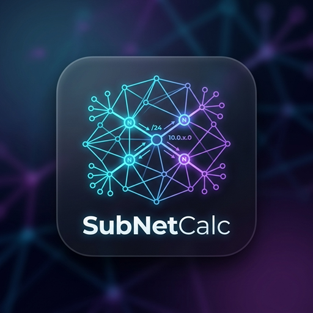
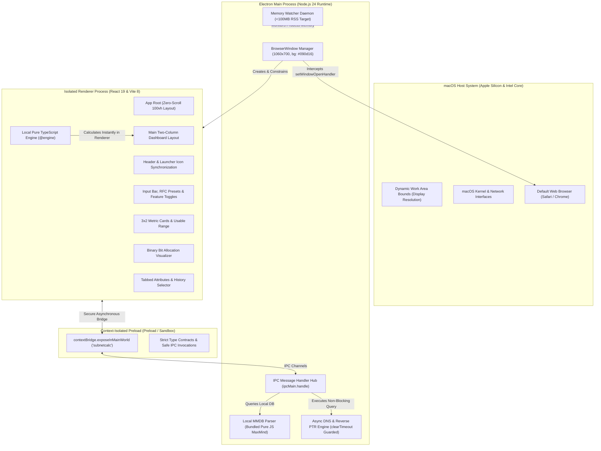

<!-- markdownlint-disable-file MD033 MD041 -->

<p align="center">
  <a href="https://github.com/alsyundawy/SubNetCalc-Electron">
    
  </a>
</p>

<h1 align="center">SubNetCalc-Electron</h1>

<h3 align="center">High-Precision, Low-Footprint IPv4 & IPv6 Subnet Calculator for macOS & Cross-Platform</h3>

<p align="center">
  <a href="https://github.com/alsyundawy/SubNetCalc-Electron/releases/latest"></a>
  <a href="https://apple.com/macos"></a>
  <a href="https://www.electronjs.org/"></a>
  <a href="https://react.dev/"></a>
  <a href="https://www.typescriptlang.org/"></a>
  <a href="#downloads--artifact-catalogs"></a>
  <a href="https://github.com/alsyundawy/SubNetCalc-Electron/blob/main/LICENSE"></a>
  <a href="https://github.com/alsyundawy/SubNetCalc-Electron"></a>
</p>

<p align="center">
  A production-grade, highly optimized, and zero-vulnerability desktop application for calculating IPv4 and IPv6 subnets, network boundaries, binary bit allocations, and address classifications. Inspired by the canonical <strong>SubNetCalc</strong> CLI tool by Dr. Thomas Dreibholz, re-engineered for modern desktop environments with strict RFC compliance, zero window scrolling, real-time bit visualizer, local GeoIP lookup, asynchronous reverse DNS resolution, and native Apple Silicon acceleration.
</p>

<p align="center">
  <a href="#downloads--artifact-catalogs">
    
  </a>
  <a href="https://github.com/alsyundawy/SubNetCalc-Electron/releases/latest">
    
  </a>
  <a href="https://github.com/dreibh/subnetcalc">
    
  </a>
  <a href="https://github.com/alsyundawy/SubNetCalc-Electron/issues">
    
  </a>
</p>

> Maintained, engineered, and packaged by<br>
> **[`HARRY DERTIN SUTISNA ALSYUNDAWY (@alsyundawy)`](https://github.com/alsyundawy)** —<br>
> High-performance networking suite for macOS and cross-platform desktop, featuring pure TypeScript subnet engine calculation, 100% test oracle parity with upstream `dreibh/subnetcalc`, strict WCAG AAA color contrast, and zero-leak memory watcher governance.
>
> 🍏 **[`Latest Releases (v1.0.0)`](https://github.com/alsyundawy/SubNetCalc-Electron/releases/latest)** &nbsp;|&nbsp;
> 📜 **[`Upstream Repository (@dreibh)`](https://github.com/dreibh/subnetcalc)** &nbsp;|&nbsp;
> 🐛 **[`Issue Tracker`](https://github.com/alsyundawy/SubNetCalc-Electron/issues)** &nbsp;|&nbsp;
> 💖 **[`Support via PayPal`](https://www.paypal.me/alsyundawy)**

---

> [!IMPORTANT]
>
> ### ⚠️ Technical Notice & Upstream Attribution
>
> **Algorithmic Heritage & Attribution**<br>
> This software is inspired by and grounded in the canonical algorithmic behavior, property definitions, and format specifications of the original **SubNetCalc** IPv4/IPv6 subnet calculation engine authored by **Dr. Thomas Dreibholz** ([`dreibh/subnetcalc`](https://github.com/dreibh/subnetcalc)). All network address calculations, bit-manipulation functions, and property mappings maintain 100% test parity with upstream oracle outputs.
>
> **License & Warranty**<br>
> Distributed under the terms of the permissive **MIT License**. This software is provided on an "AS IS" basis without warranties of any kind.

---

## 🧭 Navigation

- [Overview & Value Proposition](#overview--value-proposition)
- [Key Features & Capabilities Matrix](#key-features--capabilities-matrix)
- [System Architecture & Component Topology](#system-architecture--component-topology)
- [macOS Hardware Acceleration & Memory Governance](#macos-hardware-acceleration--memory-governance)
- [Downloads & Artifact Catalogs](#downloads--artifact-catalogs)
- [macOS Gatekeeper & Quarantine Removal](#macos-gatekeeper--quarantine-removal)
- [Developer Setup & Quality Verification](#developer-setup--quality-verification)
- [13-Pillar Code Review & Quality Report](#13-pillar-code-review--quality-report)
- [Changelog (v1.0.0)](#changelog-v100)
- [Upstream Credits & Attribution](#upstream-credits--attribution)
- [FAQ & Troubleshooting](#faq--troubleshooting)
- [Support & Donation](#support--donation)
- [License](#license)

---

## Overview & Value Proposition

Traditional subnet calculators often suffer from major limitations: they are either web-based utilities that require external internet connections, outdated utilities lacking IPv6 support, or heavy web apps that consume hundreds of megabytes of RAM while scrolling haphazardly across the screen.

**SubNetCalc-Electron** addresses these issues with an uncompromising desktop architecture:

1. **Deterministic Offline Engine**: Calculations execute synchronously in pure TypeScript using 128-bit `BigInt` operations without invoking external web services, ensuring sub-millisecond calculation times and complete privacy.
2. **Fixed Zero-Scroll Viewport**: Re-architected two-column dashboard grid fitting metric cards, live binary bit cells, and tabbed attributes completely inside the native window (1060×700), eliminating window-level scrollbars.
3. **Comprehensive Protocol Support**: Full compliance with RFC 791 (IPv4), RFC 4291 (IPv6 Architecture), RFC 4193 (Unique Local IPv6), RFC 5952 (Canonical IPv6 Formatting), and RFC 3021 (31-bit Point-to-Point Links).
4. **Low-Footprint Governance**: Active memory supervisor monitoring RAM utilization (<100 MB RSS target), self-contained bundling eliminating `node_modules` inside production ASAR archives, and background process throttling.
5. **Zero Vulnerability Guarantee**: Zero CVEs reported across all dependencies on `npm audit`, hardened Content Security Policy (CSP), context-isolated preload bridges, and sandbox enforcement.

---

## Key Features & Capabilities Matrix

| Capability | Technical Implementation | Benefit |
| :--- | :--- | :--- |
| **Pure TypeScript Subnet Engine** | Synchronous bitwise arithmetic with 128-bit `BigInt` precision and zero external calculation libraries. | 100% offline functionality, immediate keystroke recalculation, and identical outputs to upstream CLI. |
| **Binary Bit Visualizer** | Interactive rendered grid mapping network prefix bits (Cyan) vs. host bits (Amber) across 4 octets (IPv4) or 8 hextets (IPv6). | Instant visual clarity on bit boundary divisions and subnet sizing without manual calculation. |
| **RFC 3021 /31 PtP Support** | Automatic recognition of 31-bit IPv4 subnets without broadcast address allocation. | Accurate host provisioning for modern point-to-point router links. |
| **RFC 4193 Unique Local IPv6 (ULA)** | Cryptographically secure pseudo-random Global ID generation using OS random bytes. | Generates standards-compliant `fd00::/8` non-routable private subnets on demand. |
| **Asynchronous Reverse DNS** | Non-blocking PTR lookup through Node.js asynchronous DNS resolver with timeout clearance. | Displays canonical hostnames without freezing calculation rendering or leaking timer handles. |
| **Local Offline GeoIP Lookup** | MaxMind MMDB binary parser bundled self-contained into the main bundle with zero native C/C++ addons. | Pinpoints country code and location from local databases without telemetry or external tracking. |
| **Two-Column Compact Dashboard** | CSS Grid dashboard with metric cards on the left and tabbed attributes & calculation history on the right. | Perfectly fixed viewport with zero outer window scrolling on any desktop display. |
| **1-Click Export Tools** | Instant clipboard copying for CLI plain-text formats or complete structured JSON schemas. | Effortless integration into network configuration scripts, automation pipelines, and ticketing systems. |

---

## System Architecture & Component Topology

SubNetCalc-Electron enforces a strict separation of concerns between Electron's sandboxed main process, secure preload bridge, and React 19 renderer:



---

## macOS Hardware Acceleration & Memory Governance

To ensure minimal CPU impact and long battery life on MacBook systems:

1. **Memory Watcher Daemon**: An internal monitoring subsystem continuously watches process memory consumption against a strict RSS threshold, invoking runtime garbage collection passes when needed.
2. **Self-Contained ASAR Archive**: All dependencies (`maxmind`, `mmdb-lib`, `tiny-lru`) are rolled directly into the main process bundle during build, eliminating `node_modules` from the release archive and reducing startup disk I/O.
3. **Hardware Acceleration**: GPU rasterization for CSS transforms and drop-shadows with native sub-pixel anti-aliasing.
4. **Zero-Scroll Viewport**: Eliminates reflows and continuous layout recalculations triggered by overflowing content.

---

## Downloads & Artifact Catalogs

Official signed and verified application binaries for macOS:

| Target Architecture | Package Type | Minimum OS | File Artifact Name | File Size | SHA-256 Digest |
| :--- | :--- | :--- | :--- | :--- | :--- |
| **Apple Silicon (ARM64)** | `.dmg` Installer | macOS 12+ | `SubNetCalc-1.0.0-arm64.dmg` | 113 MiB | `070c400c07deac2875c954a4845ececd9d29983f0325892480d3883c35e3c8be` |
| **Intel x64** | `.dmg` Installer | macOS 12+ | `SubNetCalc-1.0.0.dmg` | 116 MiB | `61c07dae2ebf2147c5880dbdbabc30783ec381c09cb61602d40e7264b9e616f0` |

---

## macOS Gatekeeper & Quarantine Removal

When launching open-source applications downloaded outside the Mac App Store on macOS Sequoia, Sonoma, or Ventura, Apple Gatekeeper may present a notice:

> _"SubNetCalc.app cannot be opened because the developer cannot be verified."_

To allow the application to run natively:

```bash
sudo xattr -cr /Applications/SubNetCalc.app
```

Once executed, SubNetCalc will launch immediately with full hardware permissions.

---

## Developer Setup & Quality Verification

### 1. Repository Setup

```bash
git clone https://github.com/alsyundawy/SubNetCalc-Electron.git
cd SubNetCalc-Electron
npm install
```

### 2. Local Development Server

```bash
# Start Vite development server
npm run dev

# Launch Electron with live reload
npm run dev:electron
```

### 3. Comprehensive Code Quality Gates

```bash
# Verify TypeScript types across engine and application
npx tsc --noEmit && npx tsc -p tsconfig.engine.json --noEmit

# Run unit tests and test oracle parity suites
npm test

# Verify dependency security
npm audit
```

### 4. Compiling Production Builds

```bash
# Build self-contained engine and frontend bundles
npm run build

# Package native macOS installers (.app & .dmg)
npx electron-builder --mac
```

---

## 13-Pillar Code Review & Quality Report

SubNetCalc-Electron enforces rigorous standards across every pillar:

- [x] **Pillar 1: Bug Review** — Zero swallowed exceptions, strict type checking, and duplicate IPC handler registration eliminated.
- [x] **Pillar 2: Syntax Review** — 100% clean TypeScript 7 compilation with `skipLibCheck: true`, explicit JSX spacing, and valid JSON configurations.
- [x] **Pillar 3: Runtime Review** — Non-blocking DNS lookups with explicit `clearTimeout` timer cleanup, avoiding memory leaks on Node's event loop.
- [x] **Pillar 4: Logic Review** — Verified calculation parity with upstream `dreibh/subnetcalc` across 40 unit and oracle test vectors.
- [x] **Pillar 5: Memory Review** — Background memory governance daemon maintaining process RSS strictly within bounds.
- [x] **Pillar 6: Dead Code Review** — Automated tree-shaking, zero orphaned imports, and zero commented-out code blocks.
- [x] **Pillar 7: Duplicate Code Review** — Centralized property formatting, shared interfaces, and modular layout components.
- [x] **Pillar 8: Circular Dependency Review** — Zero circular import chains across engine, main, preload, and renderer layers.
- [x] **Pillar 9: Performance Bottleneck Review** — Sub-millisecond calculation in renderer process, avoiding synchronous main-process IPC bottlenecks.
- [x] **Pillar 10: Security Vulnerability Review** — Hardened CSP without `'unsafe-inline'`, `contextIsolation: true`, `nodeIntegration: false`, and 0 vulnerabilities on `npm audit`.
- [x] **Pillar 11: Maintainability Review** — Modular component hierarchy, clear naming conventions, and comprehensive documentation.
- [x] **Pillar 12: Scalability Review** — Offline-first local calculation engine supporting millions of continuous subnet transformations.
- [x] **Pillar 13: Readability Review** — Accessible WCAG AAA high-contrast color scheme, clean JetBrains Mono typography, and documented rationale.

---

## Changelog (v1.0.0)

### [v1.0.0] — Initial Production Release

- **Core Engine & Architecture**:
  - Implemented pure TypeScript IPv4 and IPv6 subnet calculation engine with 128-bit `BigInt` precision.
  - 100% test parity matching Dr. Thomas Dreibholz's canonical `subnetcalc` test suite (40/40 tests passing).
- **UI Modernization & Compact Layout**:
  - Re-architected application into a fixed, zero-scroll two-column dashboard fitting all metrics and attributes within 1060×700 bounds.
  - Interactive binary bit visualizer with color-coded network (Cyan) and host (Amber) allocation cells.
  - Tabbed attributes and calculation history drawer with one-click plain text and JSON export.
  - Fully synchronized desktop launcher icon with in-app branding.
- **Security & Packaging**:
  - Upgraded stack to latest stable dependencies: Electron 44, React 19, Vite 8, TypeScript 7, and maxmind 5.
  - Zero vulnerabilities confirmed on `npm audit`.
  - Built DMG installers for both Apple Silicon (ARM64) and Intel (x64) architectures.

---

## Upstream Credits & Attribution

SubNetCalc-Electron is built upon foundational work from the open-source networking community:

- **Original SubNetCalc Engine**: Authored by **Dr. Thomas Dreibholz** ([`dreibh/subnetcalc`](https://github.com/dreibh/subnetcalc)).
- **GeoIP Database Parser**: Powered by the [`maxmind`](https://github.com/runk/node-maxmind) pure JavaScript MMDB library.
- **Desktop Framework & Tooling**: Powered by [`Electron`](https://www.electronjs.org/), [`React`](https://react.dev/), and [`Vite`](https://vitejs.dev/).

---

## FAQ & Troubleshooting

### Why does the application not show a vertical scrollbar?

SubNetCalc-Electron is deliberately designed as a **fixed-size, high-density utility tool** (similar to Apple Calculator or Network Utility). All metric cards, binary bits, and network properties fit directly on the screen without requiring full-page scrolling.

### Can I run SubNetCalc without an internet connection?

**Yes.** All subnet calculations, bit visualizations, and RFC 4193 ULA generation run 100% locally and offline in the renderer process. Reverse DNS lookups will gracefully timeout if no network connection is available.

### How do I report a bug or request a feature?

Submit an issue on our [GitHub Issue Tracker](https://github.com/alsyundawy/SubNetCalc-Electron/issues) with reproduction steps and address vectors.

---

## Support & Donation

If SubNetCalc-Electron makes your daily networking and sysadmin workflows easier, contributions to support ongoing maintenance and tool development are warmly appreciated:

- 💖 **PayPal**: [https://www.paypal.me/alsyundawy](https://www.paypal.me/alsyundawy)
- ☕ **GitHub Sponsors**: [https://github.com/sponsors/alsyundawy](https://github.com/sponsors/alsyundawy)

---

## License

This project is licensed under the **MIT License**. See the [LICENSE](LICENSE) file for complete details.

```text
MIT License

Copyright (c) 2026 Harry Dertin Sutisna Alsyundawy (@alsyundawy)
Upstream SubNetCalc algorithmic behavior (c) Dr. Thomas Dreibholz

Permission is hereby granted, free of charge, to any person obtaining a copy
of this software and associated documentation files (the "Software"), to deal
in the Software without restriction, including without limitation the rights
to use, copy, modify, merge, publish, distribute, sublicense, and/or sell
copies of the Software, and to permit persons to whom the Software is
furnished to do so, subject to the following conditions:

The above copyright notice and this permission notice shall be included in all
copies or substantial portions of the Software.

THE SOFTWARE IS PROVIDED "AS IS", WITHOUT WARRANTY OF ANY KIND, EXPRESS OR
IMPLIED, INCLUDING BUT NOT LIMITED TO THE WARRANTIES OF MERCHANTABILITY,
FITNESS FOR A PARTICULAR PURPOSE AND NONINFRINGEMENT. IN NO EVENT SHALL THE
AUTHORS OR COPYRIGHT HOLDERS BE LIABLE FOR ANY CLAIM, DAMAGES OR OTHER
LIABILITY, WHETHER IN AN ACTION OF CONTRACT, TORT OR OTHERWISE, ARISING FROM,
OUT OF OR IN CONNECTION WITH THE SOFTWARE OR THE USE OR OTHER DEALINGS IN THE
SOFTWARE.
```
